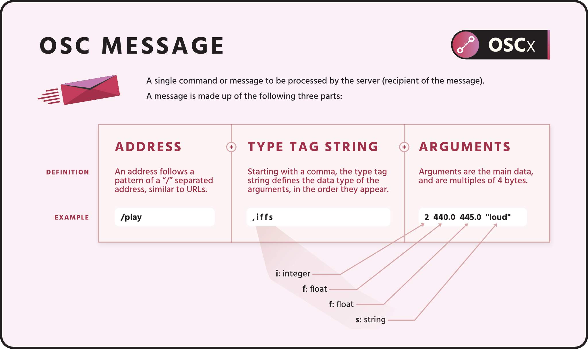
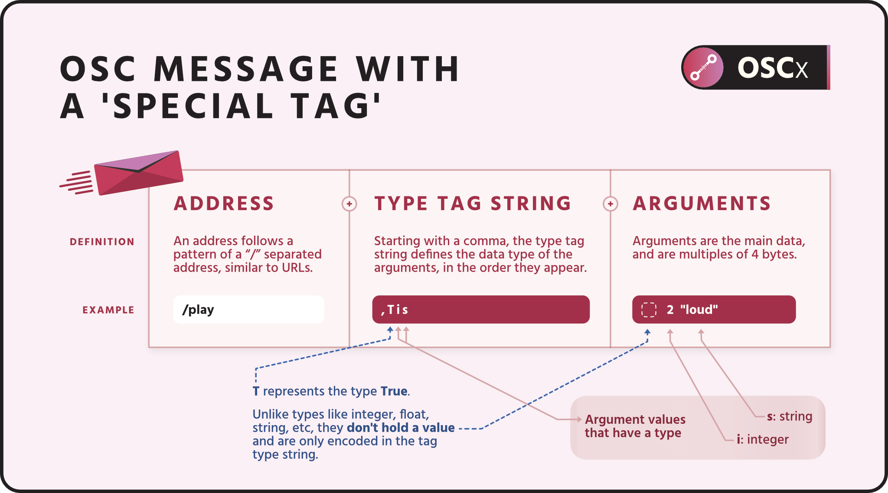

# Arguments and types

The purpose of this page is to document:

- What arguments are
- Which types of arguments are recgonised by this library
- How Elixir types are encoded to OSC
- How OSC types are decoded to Elixir.

## About OSC arguments
Arguments represent the main data or 'payload' in an OSC message.

Arguments are typed. In an OSC message, the type of an argument is listed in the OSC tag type string, in the order the argument appears in the message.



OSC is encoded into 4-byte chunks. That is Ok for 32-bit data types are they are already of a 4-byte length, but for arbintary length data (like strings or blobs) padding with some null bytes may be needed to ensure each chunk is 4 bytes. 

The following diagram shows how each chunk is kept at exactly 4 bytes length, by adding padding where necesary:
```
Chunk 1: [D] [D] [D] [D]
Chunk 2: [D] [D] [D] [_]
Chunk 3: [D] [D] [_] [_]
Chunk 4: [D] [D] [D] [D]
```
*Key:* Where `[D]` is a byte of data and and `[_]` is a byte of empty padding.

## How Elixir types are encoded to OSC types
From Elixir, arguments are added to an OSC message using the `%OSCx.Message{}` struct. For example, below is a message with an integer of `2`, a float of `440.5` and a string `"phaser"`:
```
iex> %OSCx.Message{arguments: [2, 440.5, "phaser"]}
%OSCx.Message{address: "/", arguments: [2, 440.5, "phaser"]}
``` 
The following table shows how these and other Elixir types are encoded to OSC types:

| Elixir type      | Example argument value      | OSC type                                   | OSC spec version  |
| ---------------- | --------------------------- | ------------------------------------------ | ----------------- |
| Integer (32 bit) | `2`                         | 32-bit integer                             | 1.0+ required     |
| Integer (64 bit) | `9_223_372_036_854_775_800` | 64-bit big-endian two’s complement integer | 1.0+ non-standard |
| Float (32 bit)   | `440.5`                     | 32-bit float                               | 1.0+ required     |
| Float (64 bit)   | `2.2250738585072014e-308`   | 64-bit float                               | 1.0+ non-standard |
| String           | `"phaser"`                  | String                                     | 1.0+ required     |
| Bitstring        | `<<1, 126, 40, 33>>`        | Blob                                       | 1.0+ required     |
| Atom             | `:loud`                     | Symbol                                     | 1.0+ non-standard |
| Map with `:seconds` and `:fraction` keys | `%{seconds: _, fraction: _ }` | Time tag         | 1.1+ required     |
| Map with `:midi` key | `%{midi: _ }`           | 4 byte MIDI message                        | 1.0+ non-standard |
| Map with `:char` key | `%{char: _}`            | ASCII char (32-bit)                        | 1.0+ non-standard |
| Map with `:rgba` key with list of RGBA integers | `%{rgba: [255, 255, 90, 20]}` | 4-bit RGBA colour                          | 1.0+ non-standard |
| List             | `[1, 2, 3]`                 | Array                                      | 1.0+ non-standard |

### 'Special' types
There are also some types that are encoded differently as they don't carry a variable value like those above:

| Elixir value                | OSC type                                   | OSC spec version |
| --------------------------- | ------------------------------------------ | ---------------- |
| `true`                      | True                                       | 1.1+ required    |
| `false`                     | False                                      | 1.1+ required    |
| `nil`                       | Null                                       | 1.1+ required    |
| `:null`                     | Null                                       | 1.1+ required    |
| `:impulse`                  | Impulse (also known as Infinitum in OSC 1.0 Spec, or 'Bang')  | 1.1+ required    |



These can be used in the same way by including them within the `arguments: []` list in the `%OSCx.Message{}` struct, for example:
```
iex> iex> %OSCx.Message{arguments: [true]}
%OSCx.Message{
  address: "/",
  arguments: [true],
}

iex> iex> %OSCx.Message{arguments: [:impulse, 1.0, false, "hello"]}
%OSCx.Message{
  address: "/",
  arguments: [:impulse, 1.0, false, "hello"]
}
```
## How OSC types are decoded to Elixir types

### Decoding of arguments
Decoding is simply the reverse of the above, where the following OSC type becomes the equivalent Elixir type:
- Integer -> Integer
- Float -> Float
- String -> String
- Blob -> Bitstring (binary)
- Symbol -> Atom
- MIDI -> `%{midi: value}`
- Time tag -> `%{seconds: seconds, fraction: fraction}`
- ASCII Char -> `%{char: value}` where value will be a charlist
- RGBA colour -> `%{rgba: [r, g, b, a]}` where there is an integer value for (r)ed, g(reen), b(lue) and a(lpha) colour channels.
- Array -> List

#### Symbols, Atoms and Strings
By default, Symbols are converted to Elixir atoms. This behaviour can be changed to return a string instead. See `OSCx.Decoder.set_symbol_to_atom/1`.

### Decoding of 'special' types
The types of **True**, **False**, **Null**, **Impulse** will be decoded to `true`, `false`, `nil`, `:impulse` respectively and stored in `arguments: []` list of the `%OSCx.Message{}` struct, e.g.:
```
%OSCx.Message{
  address: "/",
  arguments: [],
  tag_types: [nil]
}
```
## More information
- [README file](README.md)
