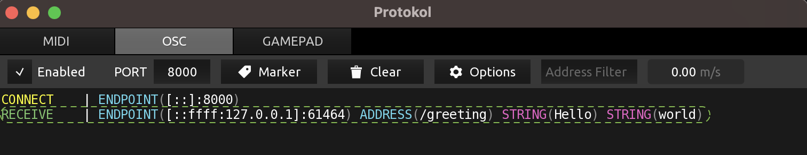
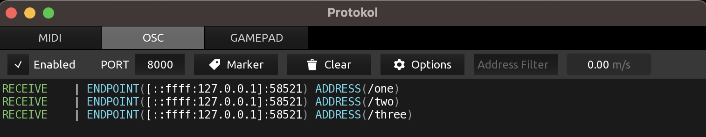

# Examples 

The purpose of this page is to show simple examples using this library.

Examples cover:
- [Creating a basic message](#creating-a-basic-message)
- [Creating a basic bundle](#creating-a-basic-bundle)
- [Working with arguments](#working-with-arguments)
- [Sending messages](#sending-messages)
- [Sending bundles](#sending-bundles)
- [Receiving messages](#receiving-messages)

You can also explore the [OSCx tour Livebook](livebook/oscx_tour.livemd) for working examples.

## Creating a basic message
You can create a message by directly populating a `%OSCx.Message{}` struct or by using `OSCx.Message.new/1`:

```
%OSCx.Message{address: "/", arguments: []}
```
or
```
iex> OSCx.Message.new(address: "/", arguments: [])
%OSCx.Message{address: "/", arguments: []}
```
You encode this message to an OSC binary format by passing this to the `OSCx.encode/1` function:
```
iex> %OSCx.Message{address: "/", arguments: []} |> OSCx.encode()
<<47, 0, 0, 0, 44, 0, 0, 0>>
```

## Creating a basic bundle
Similarily, you can create a bundle by directly populating a `%OSCx.Bundle{}` struct or by using `OSCx.Bundle.new/1`:

```
%OSCx.Bundle{
  time: %{seconds: 80, fraction: 2230576435},
  elements: [
    %OSCx.Message{address: "/one", arguments: []},
    %OSCx.Message{address: "/two", arguments: []},
    %OSCx.Message{address: "/three", arguments: []},
  ]
}

```
or
```
iex> OSCx.Bundle.new(
  time: %{seconds: 80, fraction: 2230576435},
  elements: [
    OSCx.Message.new(address: "/one", arguments: []),
    OSCx.Message.new(address: "/two", arguments: []),
    OSCx.Message.new(address: "/three", arguments: [])
  ]
)
%OSCx.Bundle{
  time: %{seconds: 80, fraction: 2230576435},
  elements: [
    %OSCx.Message{address: "/one", arguments: []},
    %OSCx.Message{address: "/two", arguments: []},
    %OSCx.Message{address: "/three", arguments: []}
  ]
}
```
You encode a bundle and its elements by passing it to the `OSCx.encode/1` function:
```
iex> %OSCx.Bundle{
  time: %{seconds: 80, fraction: 2230576435},
  elements: [
    %OSCx.Message{address: "/one", arguments: []},
    %OSCx.Message{address: "/two", arguments: []},
    %OSCx.Message{address: "/three", arguments: []}
  ]
} |> OSCx.encode()
<<35, 98, 117, 110, 100, 108, 101, 0, 0, 0, 0, 80, 132, 243, 229, 51, 0, 0, 0,
  12, 47, 111, 110, 101, 0, 0, 0, 0, 44, 0, 0, 0, 0, 0, 0, 12, 47, 116, 119,
  111, 0, 0, 0, 0, 44, 0, 0, 0, 0, 0, ...>>
```

## Working with arguments
Message arguments are added to the arguments list on the `%OSCx.Message{arguments: []}` struct.

Below is an example with each of the OSC recognised types.

### Example with Integers:
```
%OSCx.Message{address: "/", arguments: [1, 2, 3]}
```

### Example with Floats:
```
%OSCx.Message{address: "/", arguments: [0.5, 440.5]}
```

### Example with Strings:
```
%OSCx.Message{address: "/", arguments: ["Hello", "world"]}
```

### Example with Bitstrings (binary) or 'blob':
```
%OSCx.Message{address: "/", arguments: [<<1, 126, 40, 33>>]}
```

### Example with Chars:
```
%OSCx.Message{
  address: "/",
  arguments: [%{char: "A"}, %{char: ~c"B"}, %{char: ~c"C"}, %{char: 68}]
}
```
Chars use the `#{char: value}` map where the value can be a 1 byte String, a Charlist, or the integer value of the char.

### Example with Atom or 'Symbol':
```
%OSCx.Message{address: "/", arguments: [:loud, :soft]}
```

### Example with MIDI:
```
%OSCx.Message{address: "/", arguments: [%{midi: [1, 153, 77, 63]}]}
```
The MIDI format here is `[port_id,  status_byte, data_byte_1, data_byte_2]`. If only a three value message like `%{midi: [153, 77, 63]}` is given, a port_id of 0 is prepended.

### Example with RGBA colour:
```
%OSCx.Message{address: "/", arguments: [%{rgba: [255, 255, 90, 20]}]}
```

### Examples with Time tags:
Two 32-bit integers representing seconds and fraction of a second:
```
%OSCx.Message{
  address: "/",
  arguments: [%{time: %{seconds: 80, fraction: 2230576435}}]
}
```
or as a 4-bit Integer:
```
%OSCx.Message{address: "/", arguments: [%{time: 345827960115}]}
```
or to signal a time tag for 'processing immediately':
```
%OSCx.Message{address: "/", arguments: [%{time: :immediate}]}
```

### Example with a List or 'Array' in OSC: 
```
%OSCx.Message{address: "/", arguments: [1, 2, [:A, :B], 3, 4]}
```

### Example with True and False:
```
%OSCx.Message{address: "/", arguments: [true, false]}
```

### Example with Nil or Null:
You can use either Elixir's `nil` or the atom `:null` and both will be encoded to OSC's Null type:
```
%OSCx.Message{address: "/", arguments: [nil]}
```

### Example with Impulse:
Impulse isalso known as Infinitum in OSC 1.0 Spec, or 'Bang':
```
%OSCx.Message{address: "/", arguments: [:impulse]}
```

## Sending messages
Even though OSC messages are transport mechanism agnostic, they are commonly sent and received using UDP sockets.

The Erlang `:gen_utp` module can be used for this purpose. It provides the functions necessary for communicating with sockets using the UDP protocol.

### Example
You can use [Protokol](https://hexler.net/protokol) to see the the output of this message.
```
# IP or host and port number for the UDP connection
ip_address = '127.0.0.1' # This could be changed to named address, like 'localhost'
port_num = 8000 # In this example, this is the default port used by Protokol

# Open a port
{:ok, port} = :gen_udp.open(0, [:binary, {:active, true}])

# Encode the message
osc_message = %OSCx.Message{address: "/greeting", arguments: ["Hello", "world"]} |> OSCx.encode()

# Send message
:gen_udp.send(port, ip_address, port_num, osc_message)
```



## Sending bundles

### Example
You can use [Protokol](https://hexler.net/protokol) to see the the output of this message.
```
# IP or host and port number for the UDP connection
ip_address = '127.0.0.1' # This could be changed to named address, like 'localhost'
port_num = 8000 # In this example, this is the default port used by Protokol

# Open a port
{:ok, port} = :gen_udp.open(0, [:binary, {:active, true}])

# Encode the message
osc_bundle =
  %OSCx.Bundle{
    time: %{seconds: 80, fraction: 2230576435},
    elements: [
      %OSCx.Message{address: "/one", arguments: []},
      %OSCx.Message{address: "/two", arguments: []},
      %OSCx.Message{address: "/three", arguments: []},
    ]
  } |> OSCx.encode()

# Send message
:gen_udp.send(port, ip_address, port_num, osc_bundle)
```




## Receiving messages
Below is an example of a simple GenServer which can be used to send and receive OSC messages from [SuperCollider](https://supercollider.github.io/), an audio platform:

```
defmodule SC do
  use GenServer

  @impl true
  def init(_state) do
    # Open a port and add the UDP socket to the state
    {:ok, socket} = :gen_udp.open(0, [:binary, {:active, true}])

    # In this example, the socket will be used as the state of the GenServer.
    {:ok, socket}
  end

  @impl true
  def handle_cast({:send, osc_bin_msg}, state) do
    # This could be changed to named address, like 'localhost'
    ip_address = ~c"localhost"
    sc_port_num = 57110 # Default for SuperCollider
    :gen_udp.send(state, ip_address, sc_port_num, osc_bin_msg)

    {:noreply, state}
  end

  @impl true
  def handle_info(msg, state) do
    case msg do
      {:udp, _process_port, _ip_addr, _port_num, res} ->
        IO.inspect(res, label: "Binary message received")
        IO.inspect(Message.decode(res), label: "\nDecoded message")
        
      _ ->
        # Do nothing
    end

    {:noreply, state}
  end

  def start_link() do
    GenServer.start_link(SC, nil)
  end

  def send(pid, osc_bin_msg) do
    GenServer.cast(pid, {:send, osc_bin_msg})
  end
end
```

Let's start up the GenServer, and use it to send an OSC message to SuperCollider:
```
{:ok, sc_pid} = SC.start_link()

encoded_osc_msg =
  %Message{address: "/status"}
  |> OSCx.encode()

SC.send(sc_pid, encoded_osc_msg)
```

If successfull, you'll see something like the following, with the OSC message recieved from SuperCollider:

```
Binary message received: <<47, 115, 116, 97, 116, 117, 115, 46, 114, 101, 112, 108, 121, 0, 0, 0, 44,
  105, 105, 105, 105, 105, 102, 102, 100, 100, 0, 0, 0, 0, 0, 1, 0, 0, 0, 0, 0,
  0, 0, 0, 0, 0, 0, 2, 0, 0, 0, 111, 60, 201, ...>>

Decoded message: %OSCx.Message{
  address: "/status.reply",
  arguments: [1, 0, 0, 2, 111, 0.024587105959653854, 0.06639117002487183,
   44100.0, 44099.94006284866]
}
```

You can explore the SuperCollider example further in the [OSCx tour Livebook](livebook/oscx_tour.livemd).